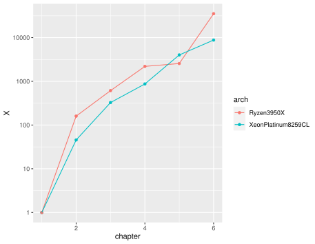

# パターソン＆ヘネシー『コンピュータの構成と設計』（第6版）より，行列の乗算

[パターソン＆ヘネシー『コンピュータの構成と設計』](https://bookplus.nikkei.com/atcl/catalog/update/21/S70090/102800002/)は，第6版で，「高速化」に関する節が，各章に含まれるようになった．そこでは，行列の乗算を題材にして，さまざまなテクニックが紹介されている．

- 第1章ではPythonで素朴に実装する．この結果が基準になる．
- 第2章では第1章のコードをC言語に翻訳する．
- 第3章ではAVX-512を導入する．
- 第4章ではループを展開する．
- 第5章では行列をブロック化する．
- 第6章ではスレッドレベルで並列化する．

Google Cloud Engineのn1-standard-96（24コアのIntel Skylake Xeonが2個）では，サイズが4096×4096の行列の乗算で，**約5万倍**（6時間→1秒弱）の高速化を実現したという．

ここでは，AVX-512を無料で使える環境であるAmazon SageMaker Studio Lab（2コアのXeon Platinum 8259CL）と，手元のPC（16コアのRyzen 3950X）で，この結果の再現を試みる．

書籍に掲載されているのは実行可能な完全なコードではないため，動作するように適当にコードを補った．サイズが4096×4096だとキャッシュライン衝突が起こるのだが，それを回避する具体的な方法が（たぶん）書かれていないため，サイズを4000×4000として実験する．（参考：[2のべき乗サイズの配列は危ないという話 via 行列積](https://elkurin.hatenablog.com/entry/2021/05/25/013033)）

Ryzen 3950XはAVX-512をサポートしていないため，AVX（256ビット）を使うコードも用意する．

Pythonのnumpy，つまりBLASによる計算も試す．

## 実行方法

```bash
python 1.py

gcc -O3 -march=native -fopenmp 2.c && ./a.out 4000
# C言語のコードの実行方法はすべて同じ
```

## 結果



Amazon SageMaker Studio Labでは**約9千倍**であった．
BLAS（numpy）を使った場合の結果と同程度である．
計算コアが少ないため（2コア），第6章のスレッドレベル並列化の効果が小さい．

Ryzen 3950Xでは**約3.5万倍**であった．
BLAS（numpy）を使った結果（約6千倍）よりかなり速い．
計算コアが比較的多いため（16コア），第6章のスレッドレベル並列化の効果が大きい．

## 結論

スレッドレベル並列化までやらないなら，numpyでいい．
